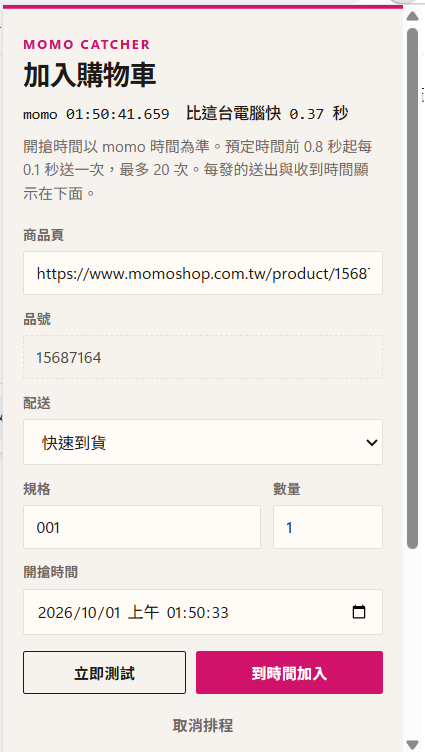

#  Momo Catcher

Chrome 擴充套件。在你已經登入的 momo 購物網裡，於指定時間把商品加入購物車，然後打開結帳畫面。最後一步「確認結帳」要自己按。

目前版本 **0.2.14**。

## 安裝

1. 打開 `chrome://extensions`。
2. 開啟右上角的「開發人員模式」。
3. 選「載入未封裝項目」，指向這個專案的 `extension` 資料夾。
4. 改過程式後，在同一頁按重新載入。看版本號是不是 `0.2.14`。

使用前，用同一個 Chrome 登入 [momo購物網](https://www.momoshop.com.tw/)。套件不保存帳號、密碼或 Cookie，請求走你目前這個瀏覽器的登入狀態。

## 使用



1. 點擴充套件圖示。
2. 貼上商品頁網址，例如 `https://www.momoshop.com.tw/product/15687164`。品號、價格、規格、配送方式會從商品頁讀出來。
3. 確認配送方式和數量。開搶時間每次打開面板都會改成這台電腦的現在時間，不會沿用上次排程。鬧鐘還在的時候，時鐘下面會顯示已排程的 momo 時間。
4. **立即測試**會立刻加一次。**到時間加入**會排程。**取消排程**會清掉鬧鐘。

請先自己打開商品頁，並讓這個已登入的 momo 分頁留在前景。已經有 `www.momoshop.com.tw` 分頁時，套件不會再新開一頁，也不會改網址。沒有的話，排程當下會開一次商品頁。

開搶前大約 5 秒，套件會把 momo 分頁拉到最前面。擴充套件面板會因此關掉，這是 Chrome 的行為。紀錄還在，之後再點圖示可以看。加入結束時會留下系統通知，請允許 Chrome 顯示通知。

## 發送方式

時間以 momo 伺服器時間為準。面板上的時鐘會顯示 momo 比這台電腦快或慢多少。

- 預定時間前 **0.8 秒**送出第一發。
- 之後每 **0.1 秒**一發，最多 **20** 次。最後一發大約在預定時間後 1.1 秒。
- 有一發成功就停止，並打開購物車、按下「結帳」。
- 不會按「確認結帳」。

加入請求是直接打購物車接口，不依賴商品頁上有沒有「加入購物車」按鈕。還沒開賣時頁面沒有那個按鈕，仍然可以先排程。

## 紀錄怎麼看

標題的預定時間是 **momo 時間**。每一行的送出、收到是 **這台電腦的時間**。標題會寫 momo 比這台電腦快或慢幾毫秒。

`延遲` 是相對預定時間。負值代表提早，正值代表晚了。

| 結果 | 意思 |
| --- | --- |
| `ok` | 已加入。後面還在飛的請求會被取消，紀錄寫「已中止」。 |
| `這個 Chrome 還沒登入 momo` | 這個瀏覽器沒有 momo 登入狀態。排程會停止再加入，不會去結帳。 |
| `已超過此商品的限購數量` | 購物車裡這個商品已經到限購。停止再加入，直接去結帳。 |
| `Failed to fetch` | 瀏覽器沒有拿到回應。停止再發。已經送出的那幾發仍會記下來。 |
| `已中止` | 前一發已經成功或已停止，這一發被取消，不是 momo 拒絕。 |

## 檔案

```
extension/
  icons/           工具列圖示
  manifest.json    套件設定與版本
  popup.html       面板
  popup.js         表單、時鐘、紀錄
  popup.css
  background.js    排程、對時、加入購物車、打開結帳
  display.js       排程是否還在、結果通知的文字
  payload.js       從商品頁讀資料，組加入購物車的內容
```

商品頁解析的測試在 `test/`。在專案根目錄執行 `node --test`。

## 注意

這是給自己帳號、在自己的瀏覽器裡使用。數量若一次加超過限購，momo 會擋下多出來的件數。重疊送出的請求有可能在限購生效前多加進購物車，多餘的要自己刪。
